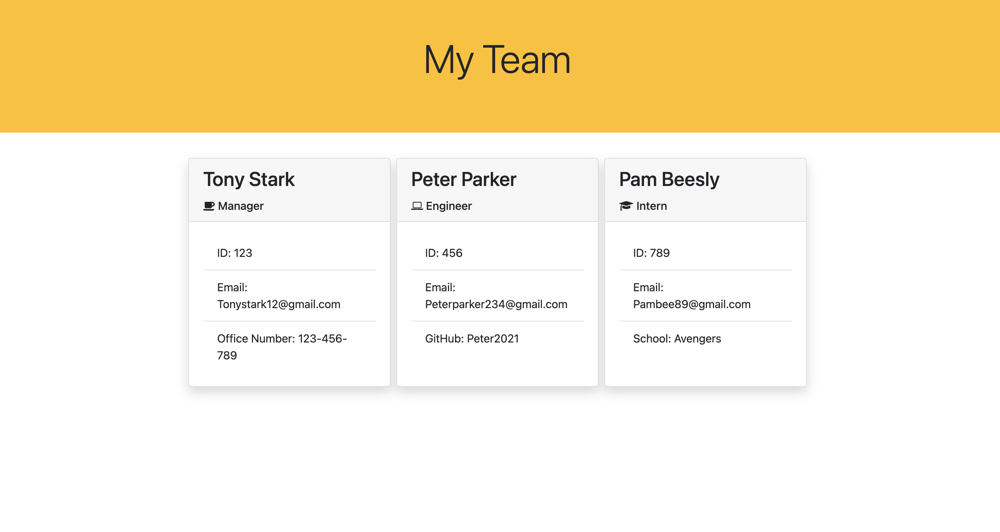

# Project Title: Team-Profile-Generator

## Description:

A Node is a command-line application that takes in information about employees and creates an HTML webpage that displays summaries for each Employee.

## Installation:

npm install 

npm install inquirer

## Usage:

This will help to a create an HTML webpage that displays summaries for each Employee from the command line.

Here is the Demo :
https://watch.screencastify.com/v/nKhHS6gWj5rDteWiRZ50

## Screenshots:

## Username:

https://github.com/sarasuni

## Email:

Sarasuni2021@gmail.com

